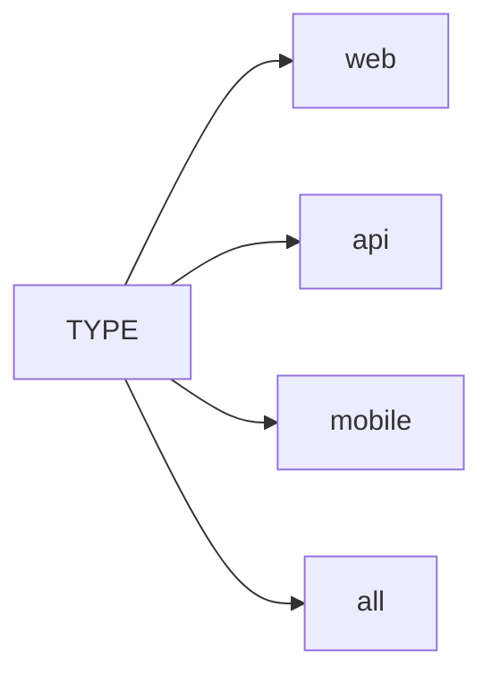

# Проект автоматизации тестирования сайта [Лепрозорий](https://leprosorium.ru)
<a href="https://leprosorium.ru" target="_blank"></a>
>Суверенный Лепрозорий — закрытый коллективный блог, со своей мифологией,\
>своеобразными правилами и своеобразным цинично-глумливым юмором, отсоединившийся от <a href="https://d3.ru/">dirty.ru.</a>\
>Состоит из сайта, а также приложений для iOS (официальное) и Android (неофициальное).

<a id="tableofcontents"></a>
## Содержание :bookmark_tabs:
➠ <a href="#stack">Cтек технологий</a></br>
➠ <a href="#testcases">Реализованные проверки</a></br>
➠ <a href="#jenkins">Сборка в Jenkins</a></br>
➠ <a href="#console">Запуск из терминала</a></br>
➠ <a href="#properties">Файлы свойств</a></br>
➠ <a href="#allure">Allure отчет</a></br>
➠ <a href="#alluretestops">Allure TestOps</a></br>
➠ <a href="#jira">Интеграция с Jira</a></br>
➠ <a href="#telegram">Отчет в Telegram</a></br>
➠ <a href="#slack">Отчет в Slack</a></br>
➠ <a href="#video">Видео прохождения теста</a></br>
➠ <a href="#appium">Appium</a></br>
➠ <a href="#browserstack">BrowserStack</a>

<a id="stack"></a>
## Cтек технологий :hammer_and_wrench:

<table>
  <tr>
    <td align="center" width="96">
      <a href="https://www.jetbrains.com/idea/">
        
      </a>
      <br>InteliJ IDEA
    </td>
    <td align="center" width="96">
      <a href="[#macropower-tech](https://www.java.com/)">
        
      </a>
      <br>Java
    </td>
    <td align="center" width="96">
      <a href="https://junit.org/junit5/">
        
      </a>
      <br>JUnit 5
    </td>
    <td align="center" width="96">
      <a href="https://selenide.org/">
        
      </a>
      <br>Selenide
    </td>
    <td align="center" width="96">
      <a href="https://aerokube.com/selenoid/">
        
      </a>
      <br>Selenoid
    </td>
    <td align="center" width="96">
      <a href="https://gradle.org/">
        
      </a>
      <br>Gradle
    </td>
    <td align="center" width="96">
      <a href="https://www.jenkins.io/" >
        
      </a>
      <br>Jenkins
    </td>
    <td align="center" width="96">
      <a href="https://rest-assured.io/">
        
      </a>
      <br>REST Assured
    </td>
    <td align="center" width="96">
      <a href="https://www.selenium.dev/">
        
      </a>
      <br>Selenium
    </td>
  </tr>
  <tr>
      <td align="center" width="96">
      <a href="https://github.com">
        
      </a>
      <br>GitHub
    </td>
    <td align="center" width="96"> 
      <a href="https://developer.android.com/studio" >
        
      </a>
      <br>AndroidStudio
    </td>
    <td align="center" width="96">
      <a href="https://www.browserstack.com" >
        
      </a>
      <br>Browserstack
    </td>
    <td align="center"  width="96">
      <a href="https://appium.io/">
        
      </a>
      <br>Appium
    </td>
    <td align="center"  width="96">
      <a href="https://github.com/allure-framework/">
        
      </a>
      <br>Allure
    </td>
    <td align="center" width="96">
      <a href="https://qameta.io">
        
      </a>
      <br>Allure TestOps
    </td>
    <td align="center"  width="96">
      <a href="https://www.atlassian.com/software/jira">
        
      </a>
      <br>Jira
    </td>
    <td align="center" width="96">
      <a href="https://telegram.org/" >
        
      </a>
      <br>Telegram
    </td>
    <td align="center" width="96">
      <a href="https://slack.com" >
        
      </a>
      <br>Slack
    </td>
  </tr>
</table>

В этом проекте автотесты написаны на <code>Java</code> с использованием <code>Selenide</code> для UI тестов.
>
> <code>Selenoid</code> запускает браузеры в <code>Docker</code> контейнере.
>
> <code>Gradle</code> используется для автоматизированной сборки проекта.
>
> <code>JUnit 5</code> используется как библиотека модульного тестирования.
>
> <code>Jenkins</code> проводит тесты.
>
> <code>Allure Report</code> формирует отчет о выполнении теста.
>
> После завершения прогона уведомления отправляются с помощью бота в <code>Telegram</code> и <code>Slack</code>.


<a id="testcases"></a>
## Реализованные проверки :mag:
### Web:
<p align="center">

</p>

### Api:
<p align="center">

</p>

### Mobile:
<p align="center">

</p>
<p align="right"><a href="#tableofcontents">Вернуться к содержанию ⬆</a></p>

<a id="console"></a>
## Запуск из терминала :desktop_computer:
### Локальный запуск:
> В каталоге resources/configuration находятся конфиги с параметрами для запуска тестов.<br>
> Необходимо заполнить следующие файлы: <br>
> src/test/resources/config/web/local.properties <br>
> src/test/resources/config/mobile/emulation.properties <br>
> src/test/resources/config/mobile/emulation.properties <br>
> (примеры включены в этот проект github). <br>
> Как только это будет сделано, вы можете запустить следующие команды:
```
gradle clean webTests
gradle clean mobileTests -DmobileHost=emulation
```

### Удалённый запуск:
> В каталоге resources/configuration находятся конфиги с параметрами для запуска тестов.<br>
> Необходимо заполнить следующие файлы: <br>
> src/test/resources/config/web/remote.properties <br>
> src/test/resources/config/mobile/browserstack.properties <br>
> src/test/resources/config/api/api.properties <br>
> (примеры включены в этот проект github).<br>
> Как только это будет сделано, вы можете запустить следующие команды:
```
gradle clean 
${TYPE}Tests
```



### Отчет:
```bash
allure serve build/allure-results

```
<p align="right"><a href="#tableofcontents">Вернуться к содержанию ⬆</a></p>

<a id=#properties></a>
## Файлы свойств :bookmark_tabs:
Возможные свойства в .properties файле:

>- *baseUrl* - базовый URL для веб-тестов
>- *browser* - браузер для веб-тестов
>- *browserSize* - версия браузера для веб-тестов
>- *browserSize* - размер браузера для веб-тестов
>- *remoteUrl* - URL удалённого сервера (Selenoid)
>- *selenoidLogin* - логин удалённого сервера (Selenoid)
>- *selenoidPassword* - пароль удалённого сервера (Selenoid)
>
>- *platformName* - ОС мобильного устройства
>- *platformVersion* - версия ОС
>- *deviceName* - имя или серийный номер устройства
>- *appPackage* - имя Java пакета Android приложения
>- *appActivity* - имя activities приложения
>
>- *user* - логин для авторизации в BrowserStack
>- *key* - ключ для авторизации в BrowserStack
>- *app* - ключ вызова приложения в BrowserStack
>- *device* - имя устройства в BrowserStack
>- *osVersion* - версия ОС в BrowserStack
>- *project* - название проекта
>- *build* - название билда
>- *name* - имя тестов
>- *url* - URL удалённого сервера (BrowserStack) 
>
>- *uid* - ID пользователя сайта
>- *username* - логин пользователя сайта
>- *password* - пароль пользователя сайта
<p align="right"><a href="#tableofcontents">Вернуться к содержанию ⬆</a></p>

<a id="jenkins"></a>
## <a href="https://jenkins.autotests.cloud/job/Lepra//">Сборка в Jenkins</a> </img></br>
</br>

<a id="allure"></a>
## Allure отчёт </img></br>
### Обзор:
</br>
### Тесты:
</br>
### Графики:
</br>
<p align="right"><a href="#tableofcontents">Вернуться к содержанию ⬆</a></p>

<a id="alluretestops"></a>
## Allure TestOps </img></br>
### Обзор
</br>
### Тесты
</br>
### Запуск
</br>
<p align="right"><a href="#tableofcontents">Вернуться к содержанию ⬆</a></p>

<a id="jira"></a>
## Интеграция с Jira </img></br>
</br>
<p align="right"><a href="#tableofcontents">Вернуться к содержанию ⬆</a></p>

<a id="telegram"></a>
## Отчет в Telegram </img></br>
</br>
<p align="right"><a href="#tableofcontents">Вернуться к содержанию ⬆</a></p>

<a id="slack"></a>
## Отчет в Slack </img></br>
</br>
<p align="right"><a href="#tableofcontents">Вернуться к содержанию ⬆</a></p>

<a id="video"></a>
## Видео прохождения теста :clapper:
https://user-images.githubusercontent.com/7962244/213429054-df407870-c8c7-4451-9cb7-e88d79d3cb15.mp4
<p align="right"><a href="#tableofcontents">Вернуться к содержанию ⬆</a></p>

<a id="appium"></a>
### Appium Server + Appium Inspector + Android Studio Virtual Device</img></br>
</br>
<p align="right"><a href="#tableofcontents">Вернуться к содержанию ⬆</a></p>

<a id="browserstack"></a>
### BrowserStack</img></br>
### Обзор
</br>
## Видео прохождения мобильного теста в BrowserStack:clapper:
https://user-images.githubusercontent.com/7962244/213428972-84b7d80e-0323-419f-8b5e-fe072c61ad68.mp4
<p align="right"><a href="#tableofcontents">Вернуться к содержанию ⬆</a></p>


